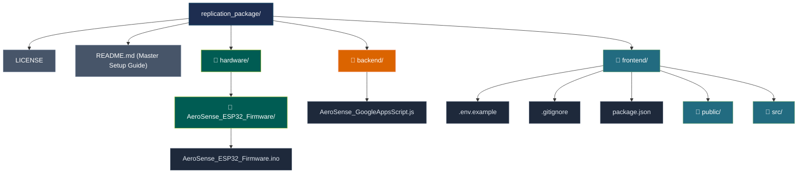

# AeroSense: Replicable Air Quality Monitoring System

AeroSense is a serverless, dual-core ESP32-powered environmental monitoring platform. It logs real-time particulate indices and gas readings to a Firebase Realtime Database to feed a high-frequency live dashboard, while archiving aggregated data to Google Sheets via Google Apps Script for long-term analytics.

This repository contains all the configuration files and codebase blueprints required to construct and deploy the system from scratch.

---

## 📁 Repository Directory Structure

```yaml
replication_package/
├── LICENSE                 # Open-source MIT License
├── README.md               # Master Setup & Replication Guide (This file)
├── 📁 backend/
│   └── AeroSense_GoogleAppsScript.js   # Serverless Apps Script database bridge
├── 📁 frontend/
│   ├── .env.example        # React environment variables template
│   ├── .gitignore          # Git exclusion rules for node_modules and .env
│   ├── package.json        # React app configuration and dependencies
│   ├── 📁 public/          # Static assets (HTML, favicon, etc.)
│   └── 📁 src/             # React components, style files, and logic
└── 📁 hardware/
    └── 📁 AeroSense_ESP32_Firmware/
        └── AeroSense_ESP32_Firmware.ino # Node 02 C++ firmware with UART2 isolation
```

### Visual Directory Flowchart


---

## 🔌 1. Hardware Pinout & Wiring Connections

Assemble your circuit or shield by routing components to the ESP32 development board according to this layout matrix:

| Sensor/Component | ESP32 Pin | Interface Type | Description |
| :--- | :--- | :--- | :--- |
| **AHT20B** (Temp & Hum) | `GPIO 21 (SDA)` / `GPIO 22 (SCL)` | I2C | Ambient Temperature and Relative Humidity |
| **LCD Screen** (16x2 I2C) | `GPIO 21 (SDA)` / `GPIO 22 (SCL)` | I2C | Local character layout readout monitor |
| **MQ2 Gas Sensor** | `GPIO 34 (ADC1)` | Analog ADC | Smoke / LPG / Hydrogen sensor |
| **MQ7 CO Sensor** | `GPIO 35 (ADC1)` | Analog ADC | Carbon Monoxide sensor |
| **PMS5003** (Laser PM) | `GPIO 16 (RX2)` / `GPIO 17 (TX2)` | UART2 | Particulate Matter PM1.0, PM2.5 & PM10 |

> [!TIP]
> **UART2 Optimization**: By moving the PMS5003 laser sensor to the hardware UART2 bus (GPIO 16 and 17), you isolate it completely from the shared USB programming lines (GPIO 1 and 3). You can flash code updates freely without physically unplugging sensor lines! Ensure you give the system a stable external 5V supply to keep the laser fan and gas heating coils performing accurately.

---

## ☁️ 2. Cloud Database Setup (Firebase RTDB)

1. Create a free project in the [Firebase Console](https://console.firebase.google.com).
2. Create a **Realtime Database** (RTDB) instance and set the server location to your nearest geographical region. Select **Start in Locked Mode** when prompted.
3. Navigate to the **Rules** tab, replace the default block completely with the open credentials below to enable your node, and click **Publish**:
   ```json
   {
     "rules": {
       ".read": true,
       ".write": true
     }
   }
   ```
4. Copy your unique **Database URL** from the top of the pane (e.g., `https://example-rtdb.firebaseio.com/`).
5. Go to **Project Settings** (gear icon) ➔ **General** tab. Scroll down to the **Your Apps** window, click the **Web icon** (`</>`), and register your app to generate your configuration keys. Save your `apiKey`, `databaseURL`, and `appId`.

---

## 📊 3. Backend & Spreadsheet Integration (Google Sheets)

1. Create a brand-new Google Spreadsheet. Look at the bottom tab manager and create three sheets, naming them exactly:
   - **`Raw_Logs`** Tab Headers (Row 1): `Timestamp` | `Node_ID` | `Node_Name` | `Location` | `PM2.5` | `PM10` | `MQ2` | `MQ7` | `Temp` | `Humidity`
   - **`Hourly_Archive`** & **`Daily_Summary`** Tabs Headers (Row 1): `Timestamp` | `Node` | `PM25_Avg` | `PM25_Min` | `PM25_Max` | `PM10_Avg` | `PM10_Min` | `PM10_Max` | `MQ2_Avg` | `MQ2_Min` | `MQ2_Max` | `MQ7_Avg` | `MQ7_Min` | `MQ7_Max` | `Temp_Avg` | `Temp_Min` | `Temp_Max` | `Hum_Avg` | `Hum_Min` | `Hum_Max`
2. In the spreadsheet toolbar menu, select **Extensions** ➔ **Apps Script**.
3. Delete any default placeholder template functions, paste the complete contents of `backend/AeroSense_GoogleAppsScript.js`, and click the **Save** disk icon.
4. **Synchronize Timezones**: Click the **Gear Icon** (Project Settings) on the left-hand navigation sidebar and check the box for **"Show 'appsscript.json' manifest file in editor"**. Return to the editor tab, click `appsscript.json`, and make sure it reads `"timeZone": "Asia/Kolkata"`. Go back to your main Google Sheet page and match this under **File** ➔ **Settings**.
5. **Deploy the Web App**: Click **Deploy** ➔ **New Deployment**. Set type to **Web App**, set *Execute as* to **Me**, and *Who has access* to **Anyone**. Click **Deploy**, complete the Google account permission authorization, and copy the generated **Web App URL**.
6. **Configure Automated Triggers**: Look at the toolbar row at the top of the script editor. Click the function dropdown menu, select `setupTriggers`, and click the **Run** button right next to it. This instantly registers the 12:45 AM daily summary analytics queue and rolling data cleanups in the background.

---

## ⚙️ 4. Deploying the ESP32 Firmware

1. Download and open the **Arduino IDE**.
2. Go to **File** ➔ **Preferences** ➔ **Additional Boards Manager URLs** and paste:
   `https://raw.githubusercontent.com/espressif/arduino-esp32/gh-pages/package_esp32_index.json`
3. Search for and install the official **esp32** core framework by Espressif Systems under the Boards Manager panel.
4. In the **Library Manager** (`Ctrl+Shift+I`), install the following external libraries:
   - `Firebase ESP32 Client` (by Mobizt)
   - `Adafruit AHTX0` (by Adafruit) — Choose "Install All" if asked for dependencies
   - `LiquidCrystal I2C` (by Frank de Brabander)
5. Open `hardware/AeroSense_ESP32_Firmware/AeroSense_ESP32_Firmware.ino`.
6. Fill in your primary WiFi credentials, Firebase API Key, Database URL, Google Script Web App URL, and your secret validation logging key in the global configuration block.
7. Go to **Tools** ➔ **Partition Scheme** and change it to **"Huge APP (3MB No OTA / 1MB SPIFFS)"** to fit the multi-client network architecture.
8. Connect the ESP32 to your computer via USB, map the correct COM Port under **Tools** ➔ **Port**, and click **Upload**.

---

## 💻 5. Frontend Web Dashboard Setup

### Environment Configuration & Local Run
1. **Create the Local Environment File**: Open your `frontend/` folder in your normal Windows File Explorer. Find a file named `.env.example`. Right-click it, select **Copy**, then right-click in an empty space inside the same folder and select **Paste**. Rename this new file copy to exactly `.env`.
2. **Insert Cloud Credentials**: Right-click your new `.env` file, choose **Open with**, and select **Notepad**. Replace the placeholder texts with your actual Firebase configuration keys, your Google Apps Script Web App URL, and your secret logging validation key. Save and close the file.
3. **Open Windows Command Prompt (CMD)**: Click directly on the address bar at the very top of your Windows File Explorer window (where the folder path is listed). Type `cmd` and press Enter. This opens a standard black Command Prompt window that is already pointed at your `frontend/` folder automatically.
4. **Install Project Dependencies**: Inside that black Command Prompt window, type this command and press Enter to download your dependencies:
   ```cmd
   npm install
   ```
5. **Launch the Local Development Server**: Once the installation finishes, type this final command in the exact same window and press Enter:
   ```cmd
   npm start
   ```
   Your web browser will automatically open up to [http://localhost:3000](http://localhost:3000) showing your live gauges. Leave this window open while you use the dashboard.

---

## 🚀 6. Production Hosting (Netlify Drag & Drop)

1. **Compile the Production Build**: When you are ready to launch your site to the public, go back to that same open Command Prompt window. Press **Ctrl + C** on your keyboard (and type **Y** then **Enter** if prompted) to stop the local server. Then, type this command and press Enter:
   ```cmd
   npm run build
   ```
   Once finished, you can close the Command Prompt window. A brand-new folder named `build` will now exist inside your `frontend/` directory.
2. **Access the Dashboard**: Open your web browser, go to [Netlify](https://www.netlify.com), and log into your account dashboard.
3. **Upload the Build Folder**: Click on the **Sites** tab in your Netlify webpage. Open your regular computer file explorer, find that newly created `build` folder inside your `frontend/` directory, and simply drag-and-drop the entire folder right into the upload box on the Netlify webpage.
4. **Go Live**: Netlify will process the files and instantly provide you with a live, secure public HTTPS link for your finished web dashboard.

---

## ✅ 7. End-to-End Integration Check

1. **Hardware Telemetry Check**: Power up your ESP32 circuit and open the Arduino IDE Serial Monitor (set to 115200 baud). Ensure the log shows a successful Wi-Fi connection, runs the NTP time synchronization, and prints `[FB] Real-Time Sync Successful`.
2. **Local Readout Check**: Look at your physical 16x2 LCD display screen. Confirm that it actively rotates through your three telemetry pages (Temperature/Humidity, MQ Gas levels, and PM Particulate values) every 10 seconds.
3. **Realtime Database Verification**: Open your online Firebase Realtime Database dashboard page. Verify that a new database node named `/devices/device_2` has automatically been created and updates live fields every 30 seconds to feed your dashboard stream.
4. **Spreadsheet Logs Verification**: Open your Google Sheet data file. Check the `Raw_Logs` tab, leave it open, and wait 5 minutes. Verify that a brand-new raw data row containing your node's metrics is appended to the bottom of the sheet right on schedule.
5. **Analytics Verification**: Open your newly hosted Netlify or local React Web Dashboard. Click over to the **History** tab after letting the station run for a few hours. Verify that the historical charts are correctly plotting your hourly and daily trends pulled from the script's calculations.
